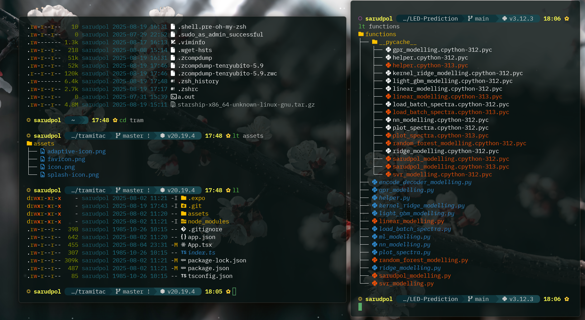
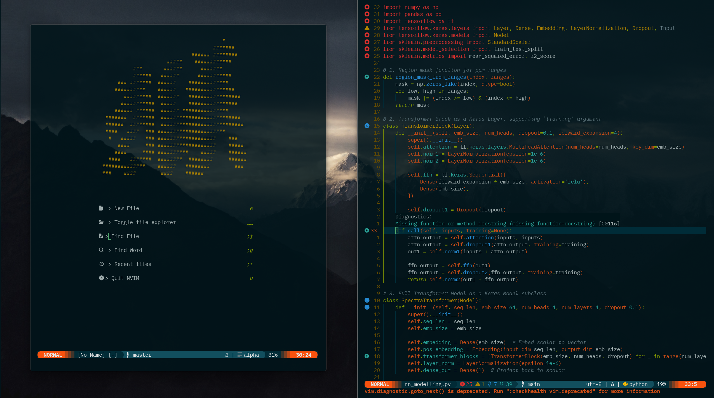

# 🏯🎋🎍🌸 saruDpol's dotfiles 🐒🥋🦧🦍





Final guidelines to install the configuration anywhere! :)

---

## 1. Install WSL and Ubuntu

1. Open PowerShell as Administrator.
2. Enable WSL:

```powershell
wsl --install
```

3. Set default version to WSL 2:

```powershell
wsl --set-default-version 2
```

4. Install Ubuntu:

```powershell
wsl --install -d Ubuntu
```

5. Launch Ubuntu from the Start menu and create your UNIX user.

---

## 2. Install WezTerm (Windows Terminal Emulator)

1. Go to [WezTerm releases](https://wezfurlong.org/wezterm/) and download the latest Windows installer.
2. Install WezTerm.
3. Now we'll configure the rest through the windows Ubuntu terminal, and after everything is set, go back to the wez configuration.

---

## 3. Open Windows Ubuntu Terminal and Update

```bash
sudo apt update && sudo apt upgrade -y
sudo apt install -y curl wget git unzip build-essential
```

---

## 4. Essential Tools to Install

- Zsh
- Oh My Zsh
- Starship Prompt
- Neovim
- Ripgrep
- Fuzzy Finder (fd)
- Zoxide
- GitHub CLI
- tmux
- Python (python3, pip, venv, pynvim)
- Node.js + npm
- Yarn
- React Native CLI
- Nerd Fonts (BlexMono)
- Optional: nvm for managing Node versions

### 4.1 Install Fonts

1. Download Nerd Font (BlexMono) from [Nerd Fonts](https://www.nerdfonts.com/font-downloads).
2. Install the font in Windows.

### 4.2 Install dependencies

To go blazingly fast...

```bash
# Update & upgrade
sudo apt update && sudo apt upgrade -y

# Install essentials
sudo apt install -y zsh curl wget git neovim ripgrep fd-find tmux python3 python3-pip python3-venv build-essential libssl-dev libffi-dev

# Switch default shell to Zsh
chsh -s $(which zsh)

# Install Oh My Zsh
sh -c "$(curl -fsSL https://raw.githubusercontent.com/ohmyzsh/ohmyzsh/master/tools/install.sh)"

# Install Starship Prompt
curl -fsSL https://starship.rs/install.sh | bash

# Install Zoxide
curl -sS https://raw.githubusercontent.com/ajeetdsouza/zoxide/main/install.sh | bash

# Python Neovim support
pip3 install --user pynvim

# Install Node.js via nvm (Node Version Manager)
curl -o- https://raw.githubusercontent.com/nvm-sh/nvm/v0.39.5/install.sh | bash
export NVM_DIR="$HOME/.nvm"
[ -s "$NVM_DIR/nvm.sh" ] && \. "$NVM_DIR/nvm.sh"
nvm install --lts
nvm use --lts

# Install Yarn
npm install --global yarn

# Install React Native CLI
npm install --global react-native-cli

```

---

## 5. Clone Your Config Repo

```bash
cd ~
git clone https://github.com/saruDpol/dotfiles
```

Move WezTerm config to Windows home:

```bash
cp ~/dotfiles/.wezterm.lua /mnt/c/Users/<YourUser>/.wezterm.lua
```

---

## 6. Link Config Files in Ubuntu

```bash
mv ~/dotfiles/.zshrc ~/.zshrc
mv ~/dotfiles/.bashrc ~/.bashrc
mv ~/dotfiles/.bash_profile ~/.bash_profile
mv ~/dotfiles/starship.toml ~/.config/starship.toml
mv ~/dotfiles/nvim ~/.config/
mv ~/dotfiles/eza ~/.config/
mv ~/dotfiles/eza ~/.config/
rm -rf dotfiles
```

---

## 7. Setup Git Authentication

```bash
git config --global user.name "Your Name"
git config --global user.email "youremail@example.com"
ssh-keygen -t ed25519 -C "youremail@example.com"
eval "$(ssh-agent -s)"
ssh-add ~/.ssh/id_ed25519
cat ~/.ssh/id_ed25519.pub  # Add to GitHub/GitLab
```

---

## 8. Try WEZ | ✅🛫

Open WezTerm, it should launch Ubuntu in Zsh with Starship prompt. Test basic commands:

```bash
cl
nvim
git status
lt
```

---
